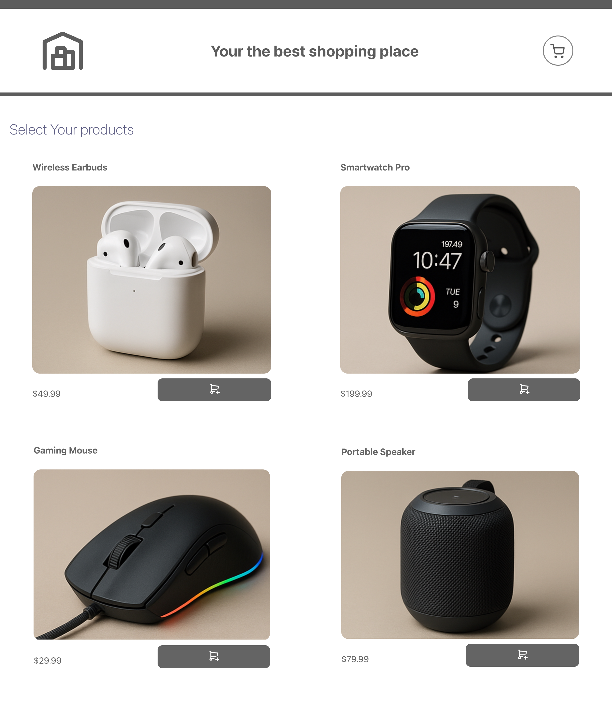

# 🛒 ShopCart

See the live version of [ShopCart](https://shop-cart-dun.vercel.app/).

ShopCart is a simple **e-commerce cart application** built with **React, TypeScript, and Redux**.  
The goal of this project is to demonstrate skills in **state management, lifecycle methods, modern React syntax (hooks, HOCs), and TypeScript typing**.

**Main features**:

- Add and remove products from the cart
- Update product quantities
- Display total cart value with automatic updates
- Example usage of both **class components** and **functional components with hooks**

&nbsp;

## 💡 Technologies


&nbsp;

## 🔗 See also

Are you interested in **React** and **TypeScript**?  
See my other project [Portfolio Projects](https://github.com/ArturDevCraft).

&nbsp;

## 💿 Installation

The project uses [node](https://nodejs.org/en/) and [npm](https://www.npmjs.com/).  
Having them installed, type into the terminal:

```bash
git clone https://github.com/ArturDevCraft/shopCart.git
cd shopCart
npm install
npm start
```
